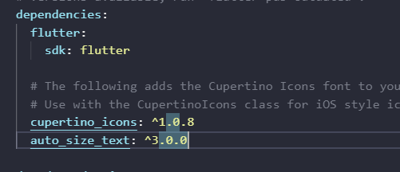
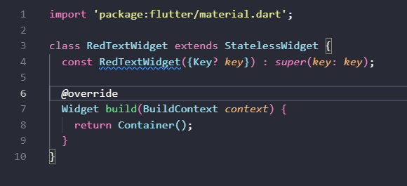

## Rakai Seto Sembodo
## TI-3G
## NIM : 2341720135

---

## Praktikum 
### Langkah 1
sudha membuat

### Langkah 2
muncul di pubspec.yaml

### Langkah 3
membuat red text widget

### Langkah 4
error dikarenakan kurang parameter text

### Langkah 6
Berhasil dijalankan di mobile

## Pertanyaan
### Jelaskan maksud dari langkah 2 pada praktikum tersebut!
Langkah 2 memastikan bahwa dependency sudah diinstal. Jika sudah, maka dependency akan muncul di pubspec.yaml

### Jelaskan maksud dari langkah 5 pada praktikum tersebut!
Dikarenakan itu adalah widget yang akan diimport berkali2, maka teksnya harus dinamis sesuai kebutuhan. Dikarenakan itu, maka teks harus disimpan di parameter. Di langkah itu, kita menginisialisasi parameter text.

### Pada langkah 6 terdapat dua widget yang ditambahkan, jelaskan fungsi dan perbedaannya!
RedTextWidget menggunakan Auto Size Text, sedangkan Text menggunakan Text. Auto Size Text memungkinkan teks untuk menyesuaikan ukuran font kepada widget yang mengandung teks tersebut.

### Jelaskan maksud dari tiap parameter yang ada di dalam plugin auto_size_text berdasarkan tautan pada dokumentasi ini !
- minFontSize	Batasan ukuran font minimum yang akan digunakan saat melakukan auto-sizing. Ukuran font tidak akan mengecil di bawah nilai ini. Diabaikan jika presetFontSizes diatur. Nilai default adalah 12.
- maxFontSize	Batasan ukuran font maksimum yang akan digunakan. Berguna jika style mewarisi ukuran font dan Anda ingin membatasinya. Diabaikan jika presetFontSizes diatur.
- stepGranularity	Ukuran langkah (penurunan) di mana ukuran font disesuaikan untuk memenuhi batasan. Misalnya, jika diatur ke 10, ukuran font akan diuji pada 40, 30, 20, dst. Sebaiknya tidak di bawah 1 untuk performa terbaik.
- presetFontSizes	Daftar ukuran font spesifik yang diizinkan. Jika diatur, minFontSize, maxFontSize, dan stepGranularity akan diabaikan. Penting: Nilai harus dalam urutan menurun.
- group	Instance dari AutoSizeGroup yang digunakan untuk menyinkronkan ukuran font dari beberapa widget AutoSizeText. Semua widget dalam grup akan menyesuaikan ukuran font mereka ke anggota grup dengan ukuran font efektif terkecil.
- overflowReplacement	Widget yang akan ditampilkan sebagai ganti teks utama jika teks tersebut overflow (tidak muat) dan tidak bisa disesuaikan ukurannya, bahkan setelah mencapai minFontSize.
- wrapWords	Menentukan apakah kata-kata yang tidak muat dalam satu baris harus dibungkus (dilanjutkan ke baris baru). Defaultnya true (berperilaku seperti Text).

### 