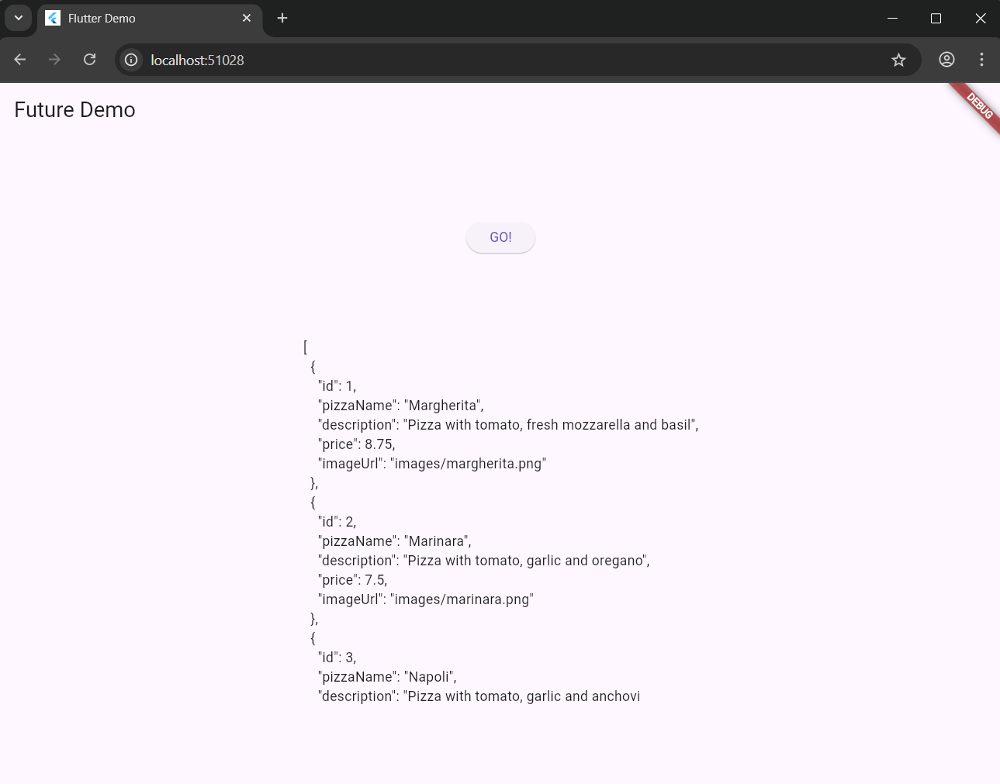

## Rakai Seto Sembodo
## TI-3G
## NIM : 2341720135

---

# Praktikum 1: Membuat layanan Mock API

**Soal 1: Tambahkan nama panggilan Anda pada title app sebagai identitas hasil pekerjaan Anda.**
Saya telah menambahkan nama panggilan saya pada `title` di `MaterialApp` dan `AppBar` pada file `main.dart`.
```dart
class MyApp extends StatelessWidget {
  // ...
  @override
  Widget build(BuildContext context) {
    return MaterialApp(
      title: 'Rakai Http Demo', // Identitas
      // ...
    );
  }
}
// ...
class MyHomePage extends StatefulWidget {
  // ...
}
```


# Praktikum 2: Mengirim Data ke Web Service (POST)

**Soal 2: Lakukan capture hasil dari Langkah 5 berupa GIF, kemudian jelaskan apa yang telah Anda buat!**
Saya telah menambahkan method `postData` yang menggunakan `http.post` untuk mengirim data JSON ke API.
- **`http.post`**: Digunakan untuk mengirim data ke server.
- **`body: json.encode(...)`**: Data yang dikirim dikemas dalam format JSON.
- **Hasil**: Ketika tombol POST ditekan, data dikirim ke server mock, dan server mengembalikan respons (biasanya data yang baru dibuat atau status sukses) yang kemudian ditampilkan di layar.