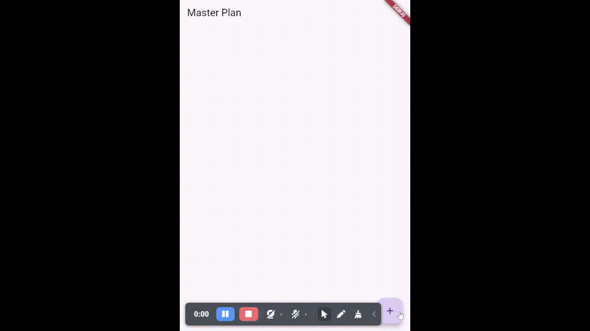

## Rakai Seto Sembodo
## TI-3G
## NIM : 2341720135

---

# Praktikum 1: Konsep Dasar State dan JSON

**Soal 1: Jelaskan maksud dari langkah 4 pada praktikum tersebut! Mengapa dilakukan demikian?**
Langkah 4 adalah membuat file `plan_screen.dart` yang berisi widget `PlanScreen`. Widget ini akan menjadi tampilan utama aplikasi yang menampilkan daftar rencana (plan).
- **Maksud**: Memisahkan kode tampilan (UI) dari logika utama aplikasi (`main.dart`).
- **Mengapa**: Untuk menerapkan prinsip *Separation of Concerns* (SoC). Dengan memisahkan UI ke dalam file tersendiri, kode menjadi lebih terorganisir, mudah dibaca, dan mudah dikelola (maintainable). `PlanScreen` saat ini masih berupa kerangka dasar (Scaffold) yang akan dikembangkan lebih lanjut untuk menampilkan daftar tugas.

**Soal 2: Mengapa perlu variabel plan di langkah 6 pada praktikum tersebut? Mengapa dibuat konstanta ?**
- **Mengapa perlu variabel plan**: Variabel `plan` di dalam `_PlanScreenState` digunakan untuk menyimpan data rencana (plan) yang sedang ditampilkan dan diedit di layar. Ini adalah "state" dari widget tersebut.
- **Mengapa dibuat konstanta**: Pada langkah awal, `plan` diinisialisasi dengan `const Plan()`. Ini membuat objek `Plan` awal bersifat *immutable* (tidak bisa diubah) dan *compile-time constant*. Hal ini efisien secara memori. Namun, saat kita mengubah data (misalnya menambah task), kita tidak mengubah objek `Plan` yang lama, melainkan membuat objek `Plan` *baru* dengan data yang diperbarui dan menimpanya ke variabel `plan` (karena variabel `plan` itu sendiri tidak final, hanya nilai awalnya yang const).

**Soal 3: Lakukan capture hasil dari Langkah 9 berupa GIF, kemudian jelaskan apa yang telah Anda buat!**
Saya telah membuat fitur untuk menampilkan daftar tugas (tasks) dalam sebuah rencana (plan).
- **ListView.builder**: Digunakan untuk merender daftar tugas secara efisien.
- **ListTile**: Digunakan untuk menampilkan setiap tugas, yang terdiri dari `Checkbox` (untuk status selesai/belum) dan `TextFormField` (untuk deskripsi tugas).
- **Interaksi**:
    - Saat tombol tambah (+) ditekan, tugas baru ditambahkan ke dalam daftar `tasks` pada objek `plan`.
    - Saat checkbox dicentang/hapus, status `complete` pada tugas yang bersangkutan diperbarui.
    - Saat deskripsi diubah, properti `description` pada tugas diperbarui.
- **State Management**: Setiap perubahan data memicu `setState`, yang menyebabkan UI dibangun ulang (rebuild) untuk mencerminkan data `plan` yang baru.
