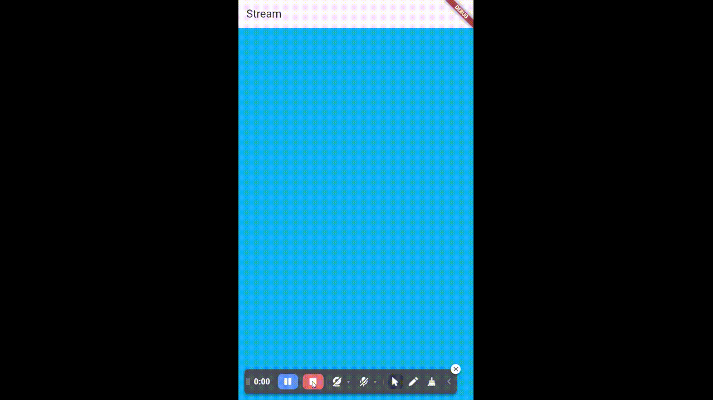
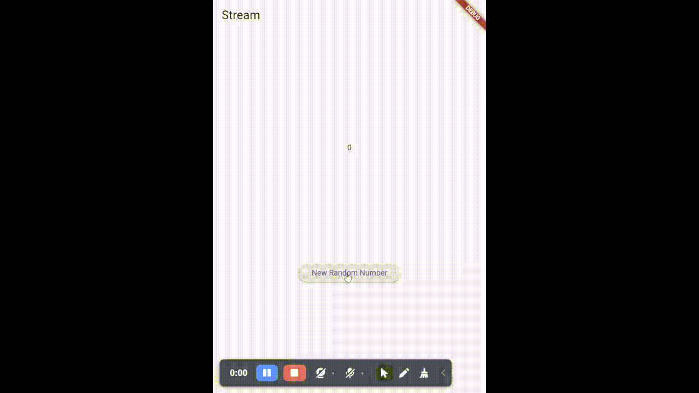

## Rakai Seto Sembodo

## TI-3G

## NIM : 2341720135

---

### SOAL

**Soal 1: Tambahkan nama panggilan Anda pada title app sebagai identitas pekerjaan Anda. Gantilah warna tema aplikasi sesuai warna kesukaan Anda.**
Saya telah mengubah `title` pada `MaterialApp` menjadi 'Stream Rakai' dan `primarySwatch` menjadi `Colors.teal` di dalam file `main.dart`.

**Soal 2: Tambahkan 5 warna lainnya pada variabel colors tersebut!**
Saya telah menambahkan warna-warna berikut ke dalam list `colors` di `stream.dart`:
```dart
final List<Color> colors = [
  Colors.blueGrey,
  Colors.amber,
  Colors.deepPurple,
  Colors.lightBlue,
  Colors.teal,
];
```

**Soal 3: Jelaskan fungsi keyword yield* pada kode tersebut!**
Keyword `yield*` digunakan untuk mendelegasikan pembuatan event ke stream lain atau iterable lain. Dalam kasus ini, `yield*` meneruskan nilai-nilai yang dihasilkan oleh `Stream.periodic`. Tanpa `yield*`, kita harus melakukan loop manual dan men-yield setiap item satu per satu. `yield*` membuat kode lebih ringkas saat kita ingin mengembalikan seluruh elemen dari stream atau iterable lain.

**Soal 4: Capture hasil praktikum Anda berupa GIF dan lampirkan di README.**


**Soal 5: Jelaskan perbedaan menggunakan listen dan await for (langkah 9 dan 13)!**
- **listen**: Metode ini mendaftarkan callback yang akan dipanggil setiap kali stream memancarkan event baru. Eksekusi kode di bawah `listen` akan terus berjalan tanpa menunggu stream selesai (non-blocking). Kita perlu mengelola subscription (misalnya membatalkannya) secara manual jika diperlukan.
- **await for**: Ini adalah konstruksi looping asynchronous. Loop ini akan menunggu setiap event dari stream dan memprosesnya satu per satu. Eksekusi kode di dalam fungsi `async` akan "berhenti" (await) di loop ini sampai stream ditutup atau break dipanggil. Ini membuat kode terlihat lebih prosedural dan mudah dibaca untuk alur yang berurutan.

**Soal 6: Jelaskan maksud kode langkah 8 dan 10 tersebut!**
- **Langkah 8 (`initState`)**: Menginisialisasi `NumberStream` dan controller-nya, kemudian mendengarkan (listen) stream tersebut. Setiap kali ada event (angka baru) yang masuk ke stream, callback `listen` akan dijalankan dan `setState` dipanggil untuk memperbarui variabel `lastNumber` dan UI.
- **Langkah 10 (`addRandomNumber`)**: Membuat angka acak antara 0-9 menggunakan `Random`. Angka ini kemudian ditambahkan ke sink dari `NumberStream` menggunakan method `addNumberToSink`. Ini akan memicu aliran data baru di stream yang kemudian ditangkap oleh listener di `initState`.

**Soal 7: Jelaskan maksud kode langkah 13 sampai 15 tersebut!**
- **Langkah 13**: Menambahkan method `addError` pada class `NumberStream` yang berfungsi untuk mengirimkan event error ke sink stream menggunakan `controller.sink.addError`.
- **Langkah 14**: Memodifikasi listener pada `initState` untuk menangani error menggunakan properti `onError`. Jika terjadi error pada stream, callback ini akan dijalankan dan `lastNumber` diubah menjadi -1.
- **Langkah 15**: Memodifikasi `addRandomNumber` agar jika angka acak yang dihasilkan kurang dari 5, angka tersebut ditambahkan ke stream. Namun jika 5 atau lebih, maka `addError` dipanggil untuk memicu error pada stream.


