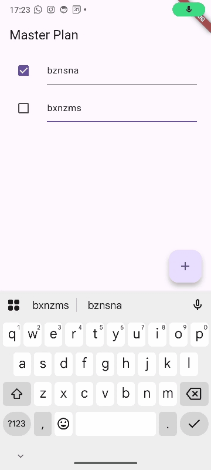
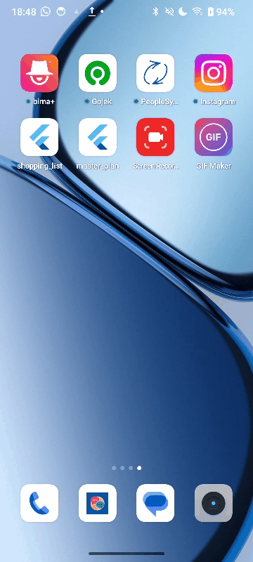

## Rakai Seto Sembodo

## TI-3G

## NIM : 2341720135

---

### Praktikum 1

**2. Jelaskan maksud dari langkah 4 pada praktikum tersebut! Mengapa dilakukan demikian?**
[JAWAB] Langkah 4 bikin `models/data_layer.dart` yang cuma `export 'plan.dart';` dan `export 'task.dart';`. Tujuannya biar import di view cukup sekali ke `data_layer.dart`, bukan nyebar import ke tiap file model. Hasilnya: import lebih rapi, gampang refactor, dan konsisten akses model.

**3. Mengapa perlu variabel plan di langkah 6 pada praktikum tersebut? Mengapa dibuat konstanta ?**
[JAWAB] Di `PlanScreen`, kita butuh `plan` sebagai state lokal layar untuk ngebuild list tugas dan ngebikin salinan baru saat ada perubahan (immutability). Awalnya di‑init `const Plan()` biar punya nilai default yang aman, immutable, dan bisa dipakai sebagai baseline sebelum user nambah task. Nanti setiap update, kita bikin objek `Plan` baru (copy with changes), bukan ngubah yang lama—ini bikin UI rebuild dengan bersih.

**4. Lakukan capture hasil dari Langkah 9 berupa GIF, kemudian jelaskan apa yang telah Anda buat!**

[JAWAB] Ini screen detail “Master Plan” berisi daftar `Task` dengan:

-   Checkbox buat toggle `complete`.
-   `TextFormField` per item buat edit `description` langsung di list.
-   FAB (+) buat nambah task kosong di akhir.
    Semua perubahan dilakukan secara immutable: kita salin `List<Task>` lalu ganti item/append, terus set ke state/notifier supaya UI auto‑rebuild.

**5. Apa kegunaan method pada Langkah 11 dan 13 dalam lifecyle state ?**
[JAWAB]

-   Langkah 11 – `build(...)`: method lifecycle inti yang nge‑render UI. Dipanggil pertama kali saat widget dibuat dan setiap kali `setState` jalan. Semua tampilan (creator list, daftar plan) dibangun di sini.
-   Langkah 13 – `addPlan()`: bukan lifecycle method, tapi fungsi yang mengubah state: ambil teks, bikin `Plan` baru, update `ValueNotifier<List<Plan>>`, clear text, dan `setState()` buat trigger rebuild. Ini bagian “update state → rebuild UI” dalam siklus hidup widget. (Lifecycle terkait lain dari langkah sebelumnya: `dispose()` buat ngebersihin `TextEditingController` saat widget di‑unmount).

### Praktikum 2

**2. Jelaskan mana yang dimaksud InheritedWidget pada langkah 1 tersebut! Mengapa yang digunakan InheritedNotifier?**
[JAWAB] In langkah 1, yang dimaksud InheritedWidget adalah `PlanProvider`—dia extend `InheritedNotifier<ValueNotifier<List<Plan>>>` supaya state daftar plan bisa diakses lintas widget tree. Kita pakai `InheritedNotifier` karena selain mewarisi perilaku `InheritedWidget` (bisa di-`of(context)`), dia otomatis nge-trigger rebuild anak saat `ValueNotifier` berubah. Jadi, begitu daftar plan ke-update, semua listener kebagian refresh tanpa manual `setState` di tiap layar.

**3. Jelaskan maksud dari method di langkah 3 pada praktikum tersebut! Mengapa dilakukan demikian?**
[JAWAB] Langkah 3 bikin method `addPlan()` di `PlanCreatorScreen`. Fungsinya: ambil teks dari `TextField`, validasi biar nggak kosong, bikin objek `Plan` baru, terus update `ValueNotifier<List<Plan>>` via `PlanProvider.of(context)` dengan list yang sudah di-copy plus plan baru. Setelah itu text dibersihin dan fokus dilepas. Ini dilakukan biar penambahan plan bersifat immutable (copy list + push) sehingga notifier ngasih sinyal ke semua subscriber dan UI langsung rebuild konsisten.

### Praktikum 3

**2. Berdasarkan Praktikum 3 yang telah Anda lakukan, jelaskan maksud dari gambar diagram berikut ini!**
[JAWAB] Diagram di praktikum 3 ngejelasin alur data Master Plan: `PlanProvider` sebagai sumber state global (`InheritedNotifier<ValueNotifier<List<Plan>>>`) → `PlanCreatorScreen` buat bikin dan memilih plan → `PlanScreen` buat ngatur task per plan. Tiap update task/plan bikin objek baru (immutable) yang dipush ke `ValueNotifier`, terus UI di semua screen auto-rebuild sesuai data terbaru.

**3. Lakukan capture hasil dari Langkah 14 berupa GIF, kemudian jelaskan apa yang telah Anda buat!**

[JAWAB] GIF Langkah 14 nunjukin flow lengkap: user nambah plan dari halaman utama, daftar plan tampil dengan progress, pilih plan buka `PlanScreen`, lalu di sana bisa nambah task via FAB, edit deskripsi inline, dan toggle checkbox. Semua perubahan state melewati `PlanProvider` sehingga daftar plan dan task tetap konsisten lintas layar
