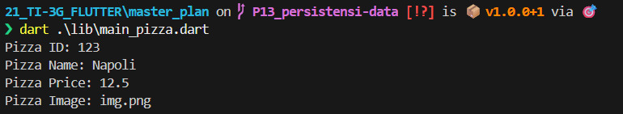
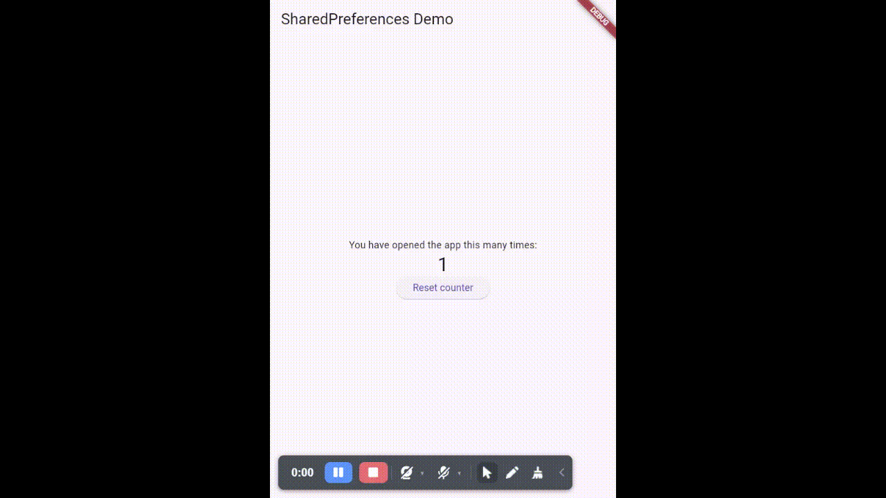

## Rakai Seto Sembodo
## TI-3G
## NIM : 2341720135

---

# Praktikum 1: Konsep Dasar State dan JSON

**Soal 1: Jelaskan maksud dari langkah 4 pada praktikum tersebut! Mengapa dilakukan demikian?**
Langkah 4 adalah membuat file `plan_screen.dart` yang berisi widget `PlanScreen`. Widget ini akan menjadi tampilan utama aplikasi yang menampilkan daftar rencana (plan).
- **Maksud**: Memisahkan kode tampilan (UI) dari logika utama aplikasi (`main.dart`).
- **Mengapa**: Untuk menerapkan prinsip *Separation of Concerns* (SoC). Dengan memisahkan UI ke dalam file tersendiri, kode menjadi lebih terorganisir, mudah dibaca, dan mudah dikelola (maintainable). `PlanScreen` saat ini masih berupa kerangka dasar (Scaffold) yang akan dikembangkan lebih lanjut untuk menampilkan daftar tugas.

**Soal 2: Mengapa perlu variabel plan di langkah 6 pada praktikum tersebut? Mengapa dibuat konstanta ?**
- **Mengapa perlu variabel plan**: Variabel `plan` di dalam `_PlanScreenState` digunakan untuk menyimpan data rencana (plan) yang sedang ditampilkan dan diedit di layar. Ini adalah "state" dari widget tersebut.
- **Mengapa dibuat konstanta**: Pada langkah awal, `plan` diinisialisasi dengan `const Plan()`. Ini membuat objek `Plan` awal bersifat *immutable* (tidak bisa diubah) dan *compile-time constant*. Hal ini efisien secara memori. Namun, saat kita mengubah data (misalnya menambah task), kita tidak mengubah objek `Plan` yang lama, melainkan membuat objek `Plan` *baru* dengan data yang diperbarui dan menimpanya ke variabel `plan` (karena variabel `plan` itu sendiri tidak final, hanya nilai awalnya yang const).

**Soal 3: Lakukan capture hasil dari Langkah 9 berupa GIF, kemudian jelaskan apa yang telah Anda buat!**
Saya telah membuat fitur untuk menampilkan daftar tugas (tasks) dalam sebuah rencana (plan).
- **ListView.builder**: Digunakan untuk merender daftar tugas secara efisien.
- **ListTile**: Digunakan untuk menampilkan setiap tugas, yang terdiri dari `Checkbox` (untuk status selesai/belum) dan `TextFormField` (untuk deskripsi tugas).
- **Interaksi**:
    - Saat tombol tambah (+) ditekan, tugas baru ditambahkan ke dalam daftar `tasks` pada objek `plan`.
    - Saat checkbox dicentang/hapus, status `complete` pada tugas yang bersangkutan diperbarui.
    - Saat deskripsi diubah, properti `description` pada tugas diperbarui.
- **State Management**: Setiap perubahan data memicu `setState`, yang menyebabkan UI dibangun ulang (rebuild) untuk mencerminkan data `plan` yang baru.
**Soal 4: Lakukan capture hasil dari Langkah 14 berupa GIF, kemudian jelaskan apa yang telah Anda buat!**
Saya telah membuat model `Pizza` yang mampu menangani ketidaksesuaian tipe data dari JSON.
- **Masalah**: JSON seringkali mengirimkan data yang tidak konsisten, misalnya angka dikirim sebagai string (`"123"`), atau field yang seharusnya ada ternyata `null`.
- **Solusi**:
    - `int.tryParse()` dan `double.tryParse()`: Digunakan untuk mencoba mengonversi string menjadi angka. Jika gagal, akan mengembalikan `null`.
    - `??` (Null Coalescing Operator): Digunakan untuk memberikan nilai default jika hasil konversi atau nilai JSON adalah `null`. Contoh: `int.tryParse(...) ?? 0` artinya jika parsing gagal, gunakan nilai 0.
    - `toString()`: Digunakan untuk memastikan nilai dikonversi menjadi string sebelum diparsing, menghindari error jika nilai aslinya bukan string.
- **Hasil**: Aplikasi dapat berjalan tanpa crash meskipun data JSON memiliki format yang tidak sesuai dengan tipe data di model Dart.
```
Pizza ID: 123
Pizza Name: Napoli
Pizza Price: 12.5
Pizza Image: img.png
```

**Soal 5: Jelaskan maksud kode langkah 5 tersebut!**
Kode langkah 5 adalah mendefinisikan konstanta untuk setiap kunci (key) JSON dan menggunakannya dalam method `fromJson` dan `toJson`.
- **Lebih Safe (Aman)**: Menggunakan konstanta menghindari kesalahan pengetikan (typo) yang sering terjadi jika kita menulis string literal berulang kali. Jika kita salah mengetik nama variabel konstanta, compiler akan memberitahu error sebelum aplikasi dijalankan (compile-time error), sedangkan salah ketik string literal baru ketahuan saat runtime.
- **Lebih Maintainable (Mudah Dipelihara)**: Jika suatu saat nama key JSON berubah dari sisi server (misalnya dari `pizzaName` menjadi `name`), kita hanya perlu mengubah nilai string pada deklarasi konstanta di satu tempat saja. Semua bagian kode yang menggunakan konstanta tersebut akan otomatis menggunakan nilai yang baru, tanpa perlu mencari dan mengganti satu per satu di seluruh file.

**Soal 6: Jelaskan maksud kode langkah 5 dan 13 tersebut!**
- **Langkah 5 (`readAndWritePreference`)**: Method ini berfungsi untuk membaca dan menulis data ke `SharedPreferences`.
    - `prefs.getInt('appCounter') ?? 0`: Membaca nilai integer dengan key 'appCounter'. Jika null (belum ada data), gunakan nilai default 0.
    - `appCounter++`: Menambahkan nilai counter.
    - `prefs.setInt('appCounter', appCounter)`: Menyimpan nilai counter yang baru ke penyimpanan lokal.
    - `setState(...)`: Memperbarui state aplikasi agar tampilan counter di layar berubah sesuai nilai terbaru.
    - Method ini dipanggil di `initState`, sehingga setiap kali aplikasi dijalankan (atau di-restart), counter akan otomatis bertambah satu.
- **Langkah 13 (`deletePreference`)**: Method ini berfungsi untuk menghapus data dari `SharedPreferences`.
    - `prefs.clear()`: Menghapus semua data yang tersimpan di SharedPreferences aplikasi ini.
    - `setState(...)`: Mereset variabel `_appCounter` menjadi 0 dan memperbarui tampilan, sehingga pengguna melihat counter kembali ke angka 0.


**Soal 7: Jelaskan maksud kode langkah 10 tersebut!**
- `getPaths()` dipanggil di dalam `initState()`.
- `initState()` adalah method yang pertama kali dipanggil ketika widget dibuat (sebelum `build`).
- Dengan memanggil `getPaths()` di sini, aplikasi akan langsung memulai proses pengambilan path direktori (dokumen dan temporary) segera setelah aplikasi dijalankan.
- Karena `getPaths()` bersifat *asynchronous* (menggunakan `await`), hasil path tidak langsung tersedia. Namun, setelah path didapatkan, `setState` akan dipanggil untuk memperbarui UI dengan path yang benar.