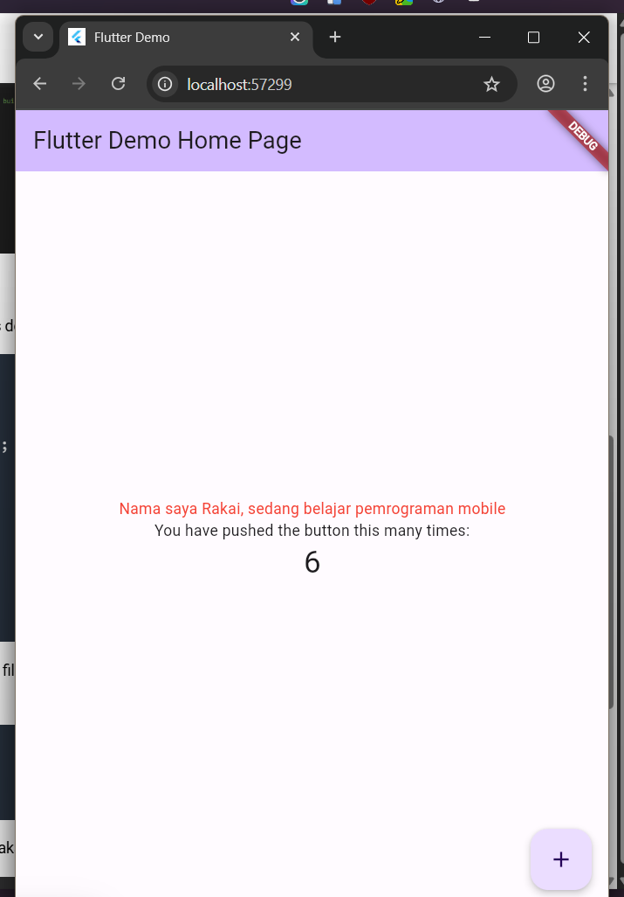
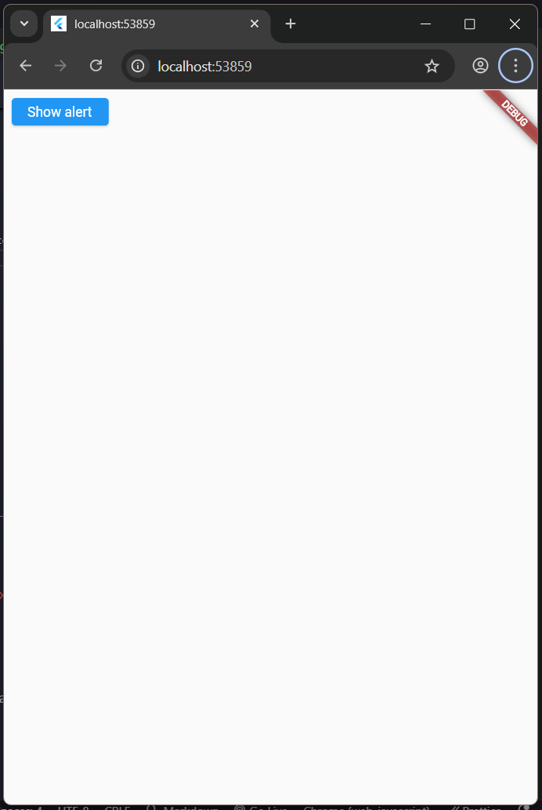
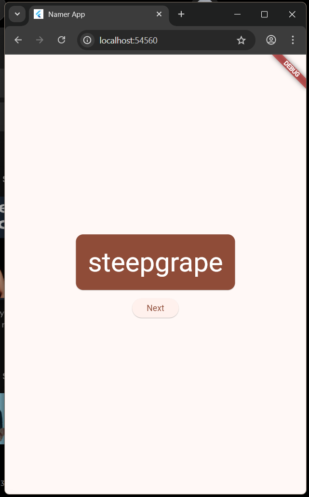
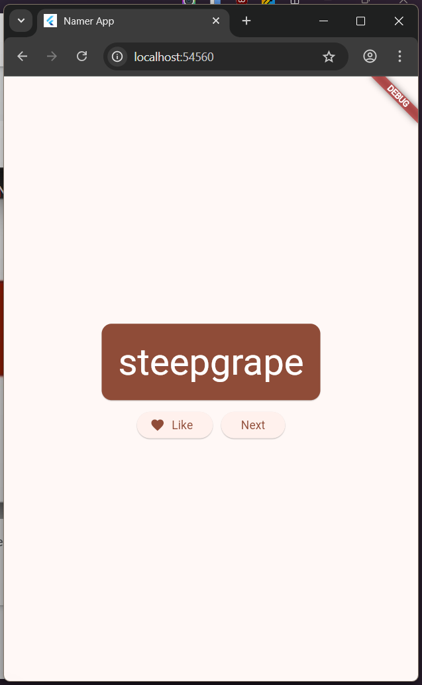
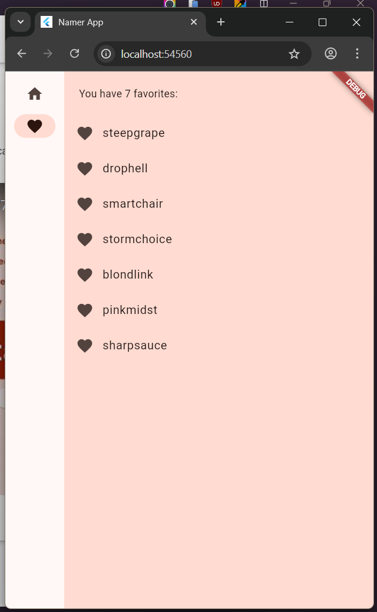

## Rakai Seto Sembodo
## TI-3G
## NIM : 2341720135

---

## Praktikum 1
hasil pembuatan project flutter

## Praktikum 2
Hasil koneksi dengan HP android

## Praktikum 3
Hasil running di chrome

## Praktikum 4
### Langkah 1
Pada langkah ini kita membuat text widget yang berisi teks "Nama saya Rakai, sedang belajar pemrograman mobile"

### Langkah 2
Pada langkah ini kita akan membuat image widget yang menampilkan gambar

## Praktikum 5
### Langkah 4
Pada langkah ini kita akan merombak layout untuk menampilkan dialog widget berdasarkan pencetan tombol

### Langkah 5
Disini kita menampilkan text input untuk menampung nama

### Langkah 6
Disini kita menampilkan date picker untuk menampilkan tanggal

---

## Tugas
### Tugas 1
done

### Tugas 2

### Tugas 3
done

### Tugas 4
Langkah 3 membuat flutter awal

Langkah 4 membuat widget untuk menampilkan teks menjadi ke tengah, dan mempercantik tampilannya secara general

Langkah 6 membuat tombol favorites

Langkah 7 menyelesaikan page favorites dan juga fungsionalitas statenya
